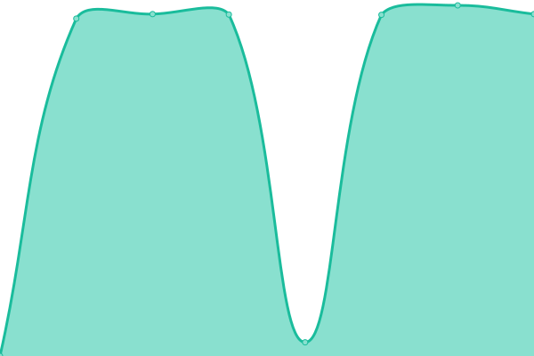
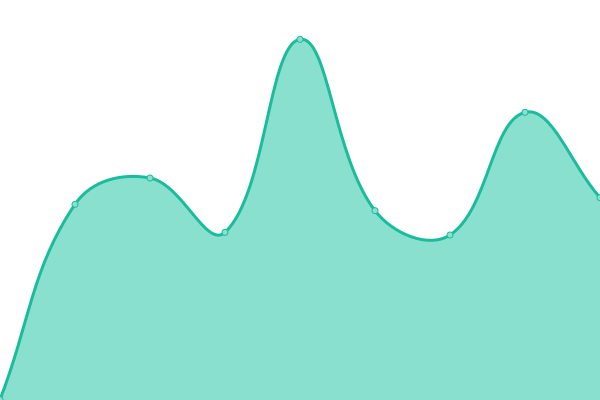
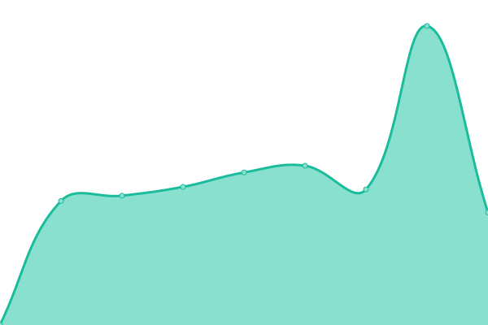

# [📈 Live Status](https://status.meter.ninja): <!--live status--> **🟩 All systems operational**

This repository contains the open-source uptime monitor and status page for [Christian Meter](https://schnaq.com), powered by [Upptime](https://github.com/upptime/upptime).

With [Upptime](https://upptime.js.org), you can get your own unlimited and free uptime monitor and status page, powered entirely by a GitHub repository. We use [Issues](https://github.com/n2o/status/issues) as incident reports, [Actions](https://github.com/n2o/status/actions) as uptime monitors, and [Pages](https://status.meter.ninja) for the status page.

<!--start: status pages-->
<!-- This summary is generated by Upptime (https://github.com/upptime/upptime) -->
<!-- Do not edit this manually, your changes will be overwritten -->
<!-- prettier-ignore -->
| URL | Status | History | Response Time | Uptime |
| --- | ------ | ------- | ------------- | ------ |
|  [Nextcloud](https://cloudy.cmeter.de) | 🟩 Up | [nextcloud.yml](https://github.com/n2o-bot/status/commits/HEAD/history/nextcloud.yml) | 

 604ms
     
 | 

<a href="https://status.meter.ninja/history/nextcloud">100.00%</a>
    

|  [Arnold Horsch e.K.](https://arnold-horsch.de) | 🟩 Up | [arnold-horsch-e-k.yml](https://github.com/n2o-bot/status/commits/HEAD/history/arnold-horsch-e-k.yml) | 

 270ms
     
 | 

<a href="https://status.meter.ninja/history/arnold-horsch-e-k">100.00%</a>
    

|  [Senne Archiv](https://sennearchiv.de) | 🟩 Up | [senne-archiv.yml](https://github.com/n2o-bot/status/commits/HEAD/history/senne-archiv.yml) | 

 734ms
     
 | 

<a href="https://status.meter.ninja/history/senne-archiv">100.00%</a>
    

|  [IG Hasten](https://ighasten.de) | 🟩 Up | [ig-hasten.yml](https://github.com/n2o-bot/status/commits/HEAD/history/ig-hasten.yml) | 

 1076ms
     
 | 

<a href="https://status.meter.ninja/history/ig-hasten">100.00%</a>
    

|  [Blumen Röttger](https://blumen-roettger.de) | 🟩 Up | [blumen-roettger.yml](https://github.com/n2o-bot/status/commits/HEAD/history/blumen-roettger.yml) | 

 633ms
     
 | 

<a href="https://status.meter.ninja/history/blumen-roettger">100.00%</a>
    

|  [GUHEMA](http://guhema.de) | 🟩 Up | [guhema.yml](https://github.com/n2o-bot/status/commits/HEAD/history/guhema.yml) | 

 1116ms
     
 | 

<a href="https://status.meter.ninja/history/guhema">100.00%</a>
    

|  [Bohm Bedachungen](https://bohm-bedachungen.de) | 🟩 Up | [bohm-bedachungen.yml](https://github.com/n2o-bot/status/commits/HEAD/history/bohm-bedachungen.yml) | 

 878ms
     
 | 

<a href="https://status.meter.ninja/history/bohm-bedachungen">100.00%</a>
    

<!--end: status pages-->

[**Visit our status website →**](https://status.meter.ninja)

## 📄 License

- Powered by: [Upptime](https://github.com/upptime/upptime)
- Code: [MIT](./LICENSE) © [Christian Meter](https://schnaq.com)
- Data in the `./history` directory: [Open Database License](https://opendatacommons.org/licenses/odbl/1-0/)
